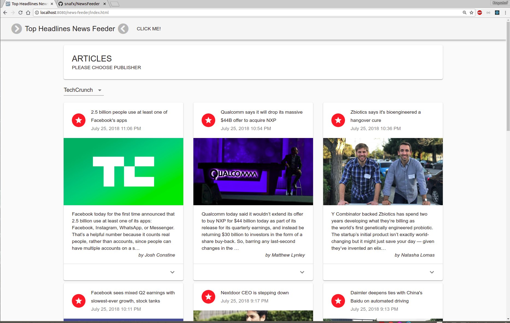
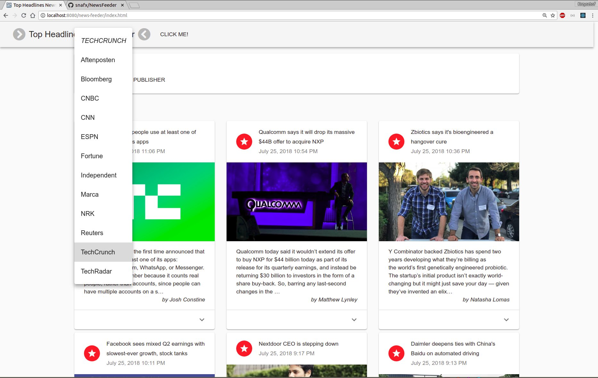
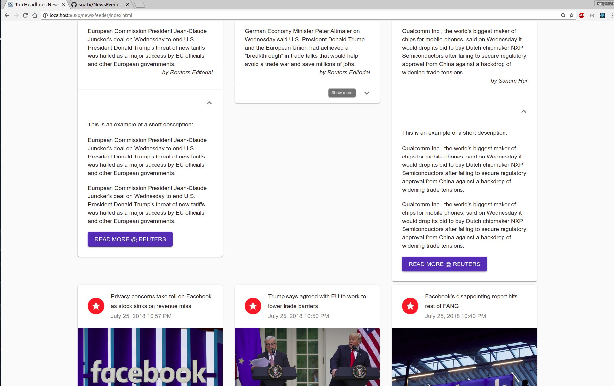

# Top Headlines News Feeder
Get breaking news headlines, and search for articles from worldwide publishers.

### TECHNOLOGY STACK
- Java 8
- Java EE
- React.js
- Wildfly
- Webpack
- Maven
- RestEasy
- JUnit
- Guava
- Git

**API to retrieve headlines and articles from http://newsapi.org/**

### INSTALATION

News Feeder requires:
- Linux OS
- Java 8
- NPM
- Wildfly 12
- Maven

Installation steps are designed to work with Linux:

**PREPARED SERVER AND APPLICATION**

**Installation/running Wildfly 12**
Download already prepared Wildfly from:

https://www.dropbox.com/s/o3517n08uzbtfs2/wildfly-12.0.0.Final.zip?dl=0

Starting server:
```sh
cd wildfly-12.0.0.Final/bin/
./standalone.sh -c standalone-full.xml
```
Wildfly user:
```sh
login: demo-user
password: q1w2e3r4t5y6
```

**Preprared server has newest application installed**

##### To access application after server is started go to:
##### http://localhost:8080/news-feeder/index.html

**NEW SERVER AND APPLICATION DEPLOY**
**Installation/configuration/running Wildfly**
Download Wildfly-12.0.0.Final from:
http://wildfly.org/downloads/

Unpack it to folder

Start server:
```sh
cd wildfly-12.0.0.Final/bin
./standalone.sh -c standalone-full.xml
```

Add new user to Wildfly:
```sh
cd wildfly-12.0.0.Final/bin
./add-user.sh

User type: a) Management User
Username: demo-user
Password: q1w2e3r4t5y6
Groups: none
```

Stop Wildfly server and start it again:
```sh
cd wildfly-12.0.0.Final/bin
./standalone.sh -c standalone-full.xml
```

Your server should be configured correctly.

##### To access application after server is restarted go to:
##### http://localhost:8080/news-feeder/index.html

### Project deployment (new)
In the project for the Linux system a script builds and uploads the project to the launched Wildfly server.
Starting script:
```sh
./deploy.sh 
```
This script build all maven modules in the project and web project (by webpack/npm).
```sh
If you have problem to open an application correctly, please copy files from 
news-feeder-web/src/main/websrc/dist/assets to news-feeder-web/src/main/webapp/assets
and again run ./deploy.sh script
```

### MODULES
- api - module where are all REST interfaces and entities used in endpoints
- common - helper classes
- integration - module where are classes downloading news from https://newsapi.org/
- web - backend and frontend News-Feeder app

### SCREEMSHOTS









